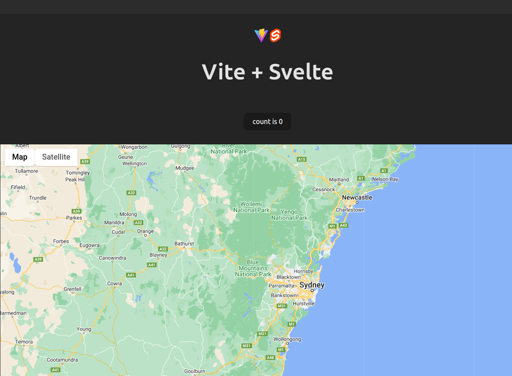

#  Vite + Svelte + Google Map

The following example it's a simple example to use google maps api with Svelte


## Create google cloud project, and enable the api

The project requires to have an Google Cloud Project, and activate the Maps Javascript Api

To create a Google Cloud Project and enable the Maps JavaScript API, follow these steps:

1. Go to the [Google Cloud Console](https://console.cloud.google.com/) and sign in with your Google account.
2. Click on the project drop-down and select "New Project".
3. Enter a name for your project and click on "Create".
4. Once your project is created, click on the navigation menu and select "APIs & Services" > "Library".
5. In the search bar, type "Maps JavaScript API" and click on the result.
6. Click on the "Enable" button to enable the API for your project.
7. You may need to set up billing for your project in order to use the Maps JavaScript API. Follow the prompts to set up billing if necessary.

Once you have completed these steps, you will have created a Google Cloud Project and enabled the Maps JavaScript API for your project.


## Get the API key

To get the API key for your project, follow these steps:

1. Go to the [Google Cloud Console](https://console.cloud.google.com/) and sign in with your Google account.
2. Select your project from the project drop-down menu.
3. In the navigation menu, click on "APIs & Services" > "Credentials".
4. Click on the "Create credentials" button and select "API key".
5. Your API key will be generated. Make sure to copy and securely store it.
6. You can now use this API key in your project to access the Google Maps API.


## Install dependencies

Go the root folder of the project and execute

```bash
npm install
```

The main package to use is `@googlemaps/js-api-loader`

## Set the API on the project

Open `src/App.svelte` and to the line #8

```javascript
    const loader = new Loader({
		apiKey: '<<Your api key>>',
		version: 'weekly'
	});
```
And set your API key in the key `apiKey`


If you want to set the coordinate, set the values on the key `center`

```javascript
    onMount(async () => {
		const { Map } = await loader.importLibrary('maps');
		map = new Map(mapContainer, {
			center: { lat: -34.397, lng: 150.644 },
			zoom: 8
		});
	});
```

## Run the project

```bash
npm run dev
```




### References


- [Google Maps Javascript Overview](https://developers.google.com/maps/documentation/javascript/overview)
- [Fireship io / svelte3-google-maps](https://github.com/fireship-io/svelte3-google-maps)

